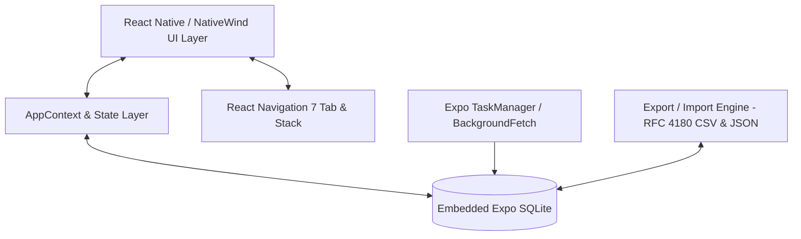
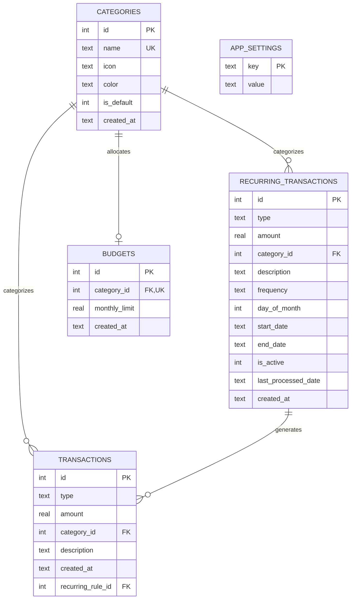

# Budget App

[](https://reactnative.dev/)
[](https://expo.dev/)
[](https://www.typescriptlang.org/)
[](https://docs.expo.dev/versions/latest/sdk/sqlite/)
[](https://www.nativewind.dev/)
[](https://opensource.org/licenses/MIT)

An enterprise-grade, privacy-first personal finance and expense tracking mobile application built with **React Native**, **Expo SDK 54**, and **TypeScript**. Powered by an embedded local **SQLite** engine, Budget App delivers sub-millisecond query performance, comprehensive financial analytics, automated recurring transaction processing, and bidirectional data portability—with zero external cloud dependencies.

---

## 📑 Table of Contents

- [Key Features](#-key-features)
- [Architecture & Tech Stack](#-architecture--tech-stack)
- [Project Structure](#-project-structure)
- [Database Schema & Migrations](#-database-schema--migrations)
- [Getting Started](#-getting-started)
  - [Prerequisites](#prerequisites)
  - [Installation](#installation)
  - [Running the Application](#running-the-application)
- [Building for Production](#-building-for-production)
  - [Local Release Build (Android APK)](#local-release-build-android-apk)
  - [Expo Application Services (EAS)](#expo-application-services-eas)
- [Data Portability & Maintenance](#-data-portability--maintenance)
- [Code Quality & Standards](#-code-quality--standards)
- [License](#-license)

---

## ✨ Key Features

### 💼 Core Transaction Management
* **Income & Expense Tracking**: High-speed entry logging with validation, customizable notes, dates, and category bindings.
* **Smart Categorization**: 14+ default curated categories with custom Material Design icons and hex colors, plus full support for custom category creation and management.
* **History & Search**: Comprehensive chronological transaction ledger with real-time text search, type filters, and swipe-to-delete actions.

### 🔁 Automated Recurring Engine
* **Background Recurring Processor**: Background scheduled tasks executing monthly recurring income and expense rules on designated cycle dates.
* **Catch-Up Synchronization**: Automatic reconciliation and backlog execution of recurring rules whenever the application launches.
* **Rule Lifecycle Management**: Active/inactive status toggles, start dates, and optional termination dates.

### 📊 Analytics, Trends & Insights
* **Multi-Period Aggregation**: Dynamic analysis across *This Month*, *Last Month*, *This Year*, and *Last Year*.
* **Executive Metrics**: Net balance, total income/expenses, savings rate calculation, average daily spend, largest single expense, and transaction frequency.
* **Visual Breakdown**: Dynamic proportion charts and color-coded category distribution bars.
* **Time-Series Trends**: Weekly distribution graphs for monthly scopes and month-over-month trend analysis for yearly views.

### 🛡️ Privacy & Customization
* **100% Offline & Local**: Zero telemetry or remote storage; all financial records remain strictly on the host device.
* **Privacy Toggle**: One-tap balance concealing across headers and metric cards for public environments.
* **Multi-Currency Support**: Native handling for major currencies (`EUR`, `USD`, `GBP`, `CAD`, `AUD`, `CHF`, `JPY`, `BRL`) with custom symbol placement (prefix/suffix).
* **Haptic Feedback**: Tactile interaction feedback across critical button actions and deletions.

---

## 🏗 Architecture & Tech Stack



| Domain | Technology | Version | Purpose |
| :--- | :--- | :--- | :--- |
| **Core Framework** | [React Native](https://reactnative.dev/) | `0.81.5` | Native mobile application runtime |
| **Tooling & Platform**| [Expo SDK](https://expo.dev/) | `~54.0.27` | Managed workflow, native modules, build pipelines |
| **Language** | [TypeScript](https://www.typescriptlang.org/) | `~5.9.2` | Static type safety and strict schema interfaces |
| **Database** | [expo-sqlite](https://docs.expo.dev/versions/latest/sdk/sqlite/) | `~16.0.10` | Embedded relational database with WAL mode & indexes |
| **Styling Engine** | [NativeWind](https://www.nativewind.dev/) / Tailwind CSS | `v4.2.1` | Utility-first responsive native styling |
| **Navigation** | [React Navigation](https://reactnavigation.org/) | `v7.x` | Native tab and stack navigators |
| **Background Tasks** | `expo-task-manager` / `expo-background-fetch` | `~14.0.9` | Headless execution for recurring transaction scheduler |
| **File I/O & Sharing** | `expo-file-system` / `expo-sharing` | `~14.0.8` | Backup exports, CSV streaming, OS sharing intents |
| **Haptics** | `expo-haptics` | `~15.0.8` | Device vibration and tactile feedback |

---

## 📂 Project Structure

```
Budget_App/
├── android/                   # Native Android project configuration & Gradle scripts
├── assets/                    # Static branding, splash screens, and icon assets
├── src/
│   ├── components/            # Reusable UI components
│   │   ├── CategoryIcon.tsx   # Material icon renderer with color bounds
│   │   ├── EmptyState.tsx     # Standardized empty states
│   │   ├── MetricCard.tsx     # Analytic stat cards with privacy masks
│   │   ├── NavBar.tsx         # Bottom tab navigation bar
│   │   ├── TransactionItem.tsx# List item component with swipe actions
│   │   └── TransactionModal.tsx# Transaction detail & edit modal
│   ├── context/
│   │   └── AppContext.tsx     # Global React Context provider (Theme, Currency, State)
│   ├── database/
│   │   ├── database.ts        # Primary SQLite query engine & aggregations
│   │   ├── exportImport.ts    # RFC 4180 CSV serializer & JSON backup/restore
│   │   ├── migrations.ts      # Schema migration runner with version tracking
│   │   ├── recurringEngine.ts # Rule scheduler, catch-up executor, & lifecycle
│   │   ├── tasks.ts           # Background task registration and handlers
│   │   └── types.ts           # Type definitions for database entities and payloads
│   ├── navigation/
│   │   ├── RootNavigator.tsx  # React Navigation container and tab definitions
│   │   └── types.ts           # Type definitions for navigation routes
│   └── screens/
│       ├── HomeScreen.tsx     # Main dashboard with current balance & quick actions
│       ├── NewTransactionScreen.tsx # Multi-step transaction and recurring creator
│       ├── HistoryScreen.tsx  # Searchable, filterable transaction ledger
│       ├── StatsScreen.tsx    # Analytics, periodic metrics, and category charts
│       ├── RecurringScreen.tsx# Active recurring rules management
│       └── SettingsScreen.tsx # Currency, category editor, database maintenance & exports
├── app.json                   # Expo application manifest
├── eas.json                   # Expo Application Services build configurations
├── tailwind.config.js         # Tailwind CSS styling configuration
├── tsconfig.json              # TypeScript compiler configuration
└── package.json               # Dependencies and scripts manifest
```

---

## 🗄 Database Schema & Migrations

The database utilizes SQLite with `WAL` (Write-Ahead Logging) and strict foreign key enforcement. Migrations are tracked sequentially via the `schema_migrations` table.



### Indexed Optimizations
* `idx_tx_created_at` & `idx_tx_date_desc` on `transactions(created_at DESC)` for fast ledger sorting.
* `idx_tx_cat_date` on `transactions(category_id, created_at DESC)` for instantaneous category queries.
* `idx_tx_type_created` on `transactions(type, created_at)` for real-time period aggregation.
* `idx_rec_active` on `recurring_transactions(is_active)` for background scheduler efficiency.

---

## 🚀 Getting Started

### Prerequisites
* **Node.js**: `v18.x` or `v20.x` LTS
* **Package Manager**: `npm` (v9+) or `yarn`
* **Android Development**: Android Studio, Android SDK (API 34+), and an Android Virtual Device (AVD) or physical device with USB debugging enabled.
* **iOS Development** (macOS only): Xcode 15+ and CocoaPods.

### Installation

1. **Clone the repository:**
   ```bash
   git clone https://github.com/Freire55/Balance_App.git
   cd Balance_App
   ```

2. **Install dependencies:**
   ```bash
   npm install
   ```

### Running the Application

* **Start Metro bundler:**
  ```bash
  npm start
  ```
* **Launch on Android:**
  ```bash
  npm run android
  ```
* **Launch on iOS:**
  ```bash
  npm run ios
  ```
* **Execute Linting:**
  ```bash
  npm run lint
  ```

---

## 📦 Building for Production

### Local Release Build (Android APK)
To assemble a standalone, installable APK locally without cloud build queues:

```bash
# Navigate to Android directory and build release bundle
cd android
./gradlew assembleRelease
```
The compiled binary will be located at:
`android/app/build/outputs/apk/release/app-release.apk`

> **Note on App Updates:** When updating an existing installation on a device, ensure the `versionCode` in [`app.json`](file:///home/tomasfreire/Documents/Personal_Projects/Budget_App/app.json) / [`android/app/build.gradle`](file:///home/tomasfreire/Documents/Personal_Projects/Budget_App/android/app/build.gradle) is incremented and signed with a consistent keystore to avoid Android package signature conflict errors.

### Expo Application Services (EAS)
To build via EAS Cloud Build:

1. Install EAS CLI globally:
   ```bash
   npm install -g eas-cli
   ```
2. Authenticate and build:
   ```bash
   eas login
   eas build -p android --profile preview
   ```

---

## 🔄 Data Portability & Maintenance

* **CSV Export**: Streams financial records compliant with RFC 4180 standard formatting for import into Microsoft Excel, Google Sheets, or ledger software.
* **Full JSON Backup & Restore**: Atomically exports and restores the entire database structure, user settings, active categories, and recurring rules.
* **Storage Maintenance**: Integrated `PRAGMA optimize`, `VACUUM`, and WAL truncation routines accessible from the Settings view to maintain optimal performance over years of usage.

---

## 🛡 Code Quality & Standards

* **TypeScript**: Strict mode enabled with exhaustive type definitions across models, navigator parameters, and payloads.
* **ESLint**: Automated static analysis using `eslint-config-expo`.
* **Atomic Transactions**: All multi-step database mutations and background jobs execute within `db.withTransactionAsync()` blocks to guarantee zero partial writes.

---

## 📄 License

This project is licensed under the MIT License — see the [LICENSE](LICENSE) file for details.

